# Echoes of the Abyss - Writeup

**CTF:** LemonCTF
**Challenge:** Echoes of the Abyss
**Category:** OSINT
**Points:** 720
**Author:** ShadowEternity

## Challenge Description
> A nameless knight, long forgotten by the flame, has scattered fragments of their soul across the digital abyss.
> They say the last Cinder still burns somewhere... waiting for an Unkindled to piece together what remains.
> To link the fire, one must first seek the fallen knight.

The challenge provided a file: `bonfire.jpg`.

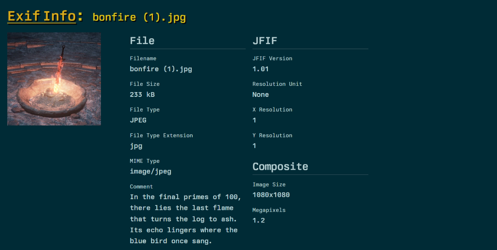

---

## Part 1: Steganography & Metadata
We started by analyzing the provided image `bonfire.jpg`. Inspection of the EXIF metadata revealed a cryptic comment:

> "In the final primes of 100, there lies the last flame that turns the log to ash. Its echo lingers where the blue bird once sang."

Breaking this down:
*   **"final primes of 100"**: The largest prime number under 100 is **97**.
*   **"blue bird once sang"**: This refers to Twitter (now X).
*   **"last flame"** + **"log to ash"**: Combined with the challenge text about "Last Cinder", we constructed a potential username: **LastCinder97**.

## Part 2: Social Media Recon (X/Twitter)
Searching for the user `@LastCinder97` on X led to a profile with a series of posts. One post stood out, containing a hex string:

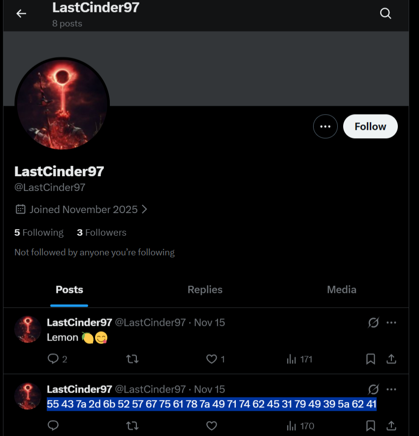

```
55 43 7a 2d 6b 52 57 67 75 61 78 7a 49 71 74 62 45 31 79 49 39 5a 62 41
```

Decoding this from Hex to ASCII:

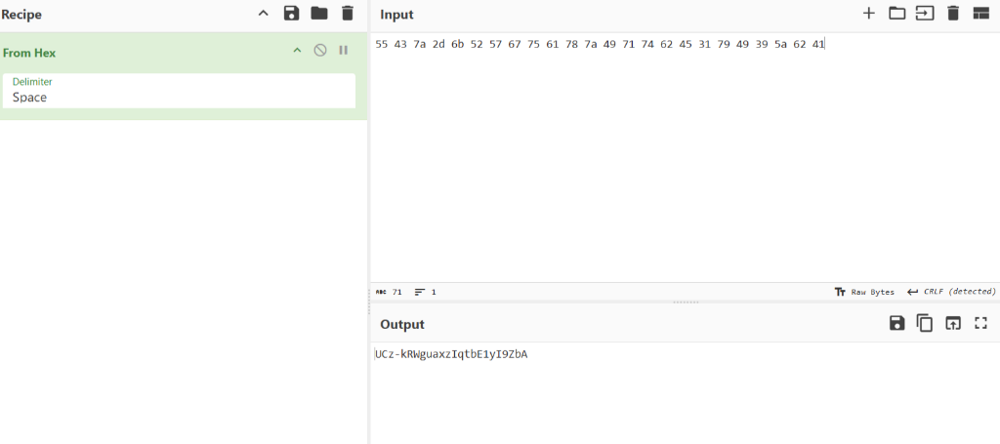

```
UCz-kRWguaxzIqtbE1yI9ZbA
```

This format (starting with `UC` and being 24 characters long) is characteristic of a **YouTube Channel ID**.

## Part 3: Video Cryptography
We navigated to the channel: `https://www.youtube.com/channel/UCz-kRWguaxzIqtbE1yI9ZbA`.
The channel banner hid a URL that led to a specific video.

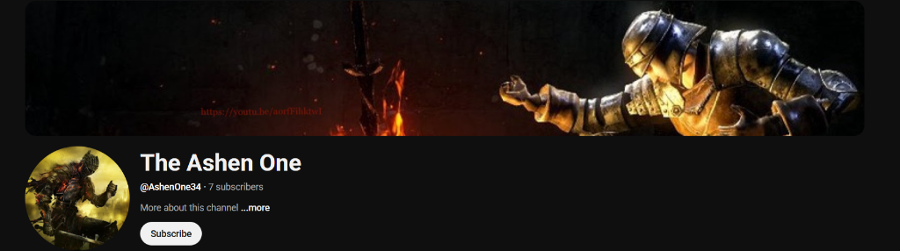

Listening to the video and checking the transcript/captions revealed a hidden code string:

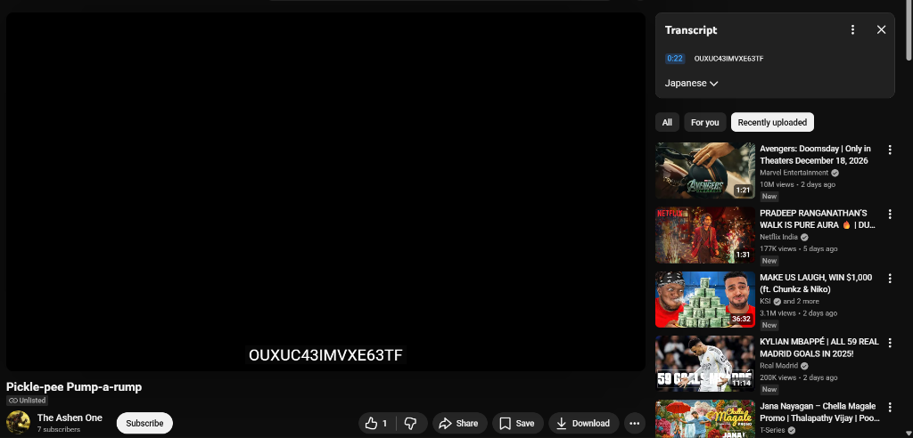

```
OUXUC43IMVXE63TF
```

Using CyberChef to analyze the string, we identified it as **Base32**. Decoding it yielded:

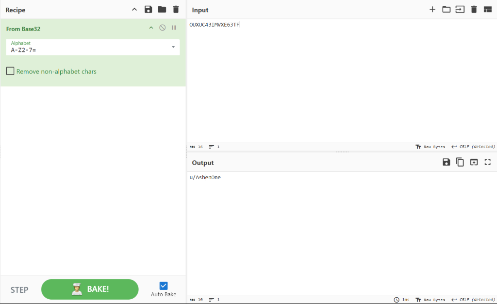

```
u/AshenOne
```

## Part 4: Reddit OSINT
The decoded string pointed to a Reddit user. Searching for `u/AshenOne` on Reddit led us to a slightly different active handle: **u/AshenOne67**.

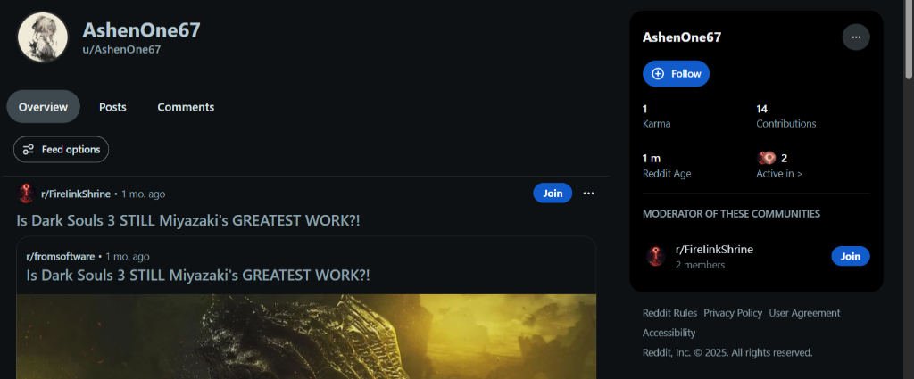

Going through the user's post history revealed a narrative:

1.  First, he posted about a personal project he was working on. In the comments of this post, he shared a link to his GitHub repository: `https://github.com/AshenOne67/SoulsTracker`. Although this link was dead, it revealed the project name: **SoulsTracker**.

    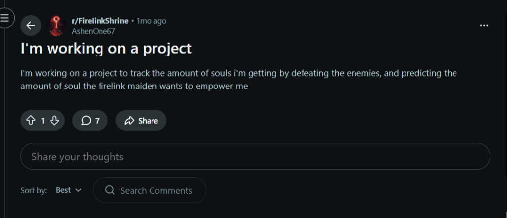
    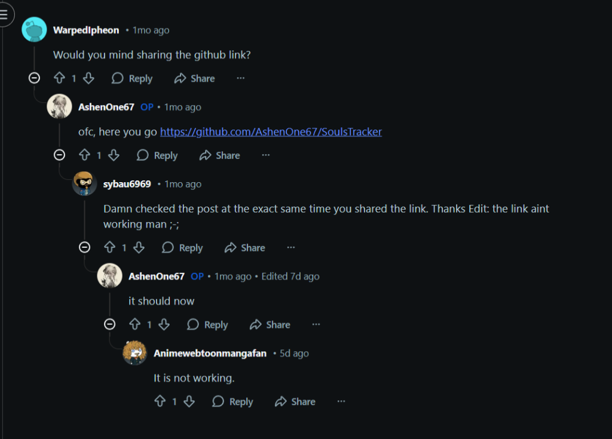

2.  Later, he made another post titled "This world is a cruel place", complaining that someone had stolen his code and hosted it on a repository with the **same name**. However, an edit to that same post mentioned they had become friends and were now collaborating under a shared organization.

    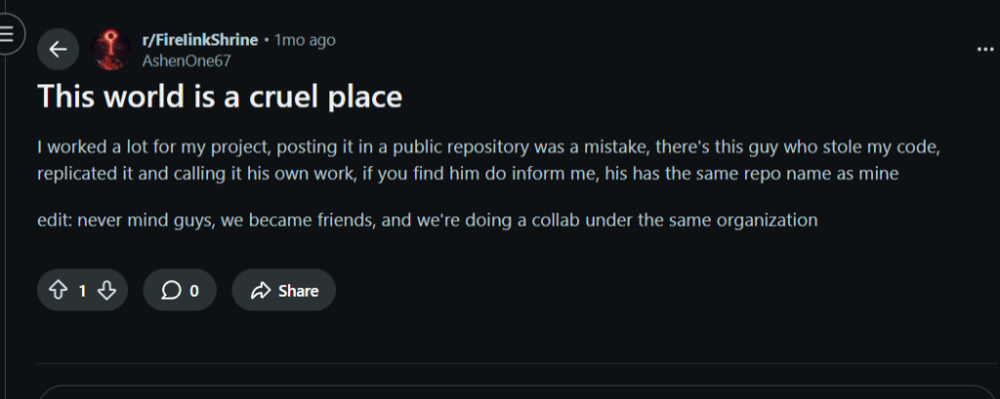

Armed with the project name "SoulsTracker" and the knowledge that the "stolen" version used the same name, we searched GitHub.
We found the active repository: **https://github.com/SoulSweepers/SoulsTracker**.
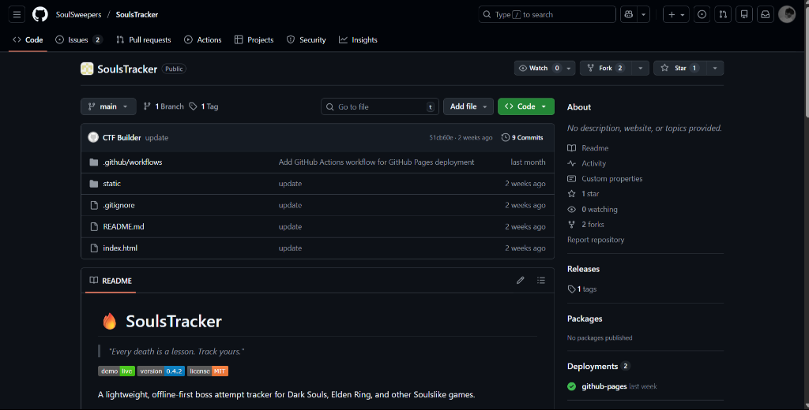

## Part 5: Git Forensics
After cloning the repository, we began investigating the version history.

```bash
git clone https://github.com/SoulSweepers/SoulsTracker
cd SoulsTracker
```

Checking the commit logs (`git log`) revealed a suspicious commit message: "Remove secret (cleanup)".

Inspecting the diff for this commit showed the deletion of `secret.txt`, which contained the text:
`PASTEBIN_LINK_PLACEHOLDER: https://pastebin.com/REPLACE_ME_SECRET`

This placeholder confirmed that the secret was indeed a Pastebin link.

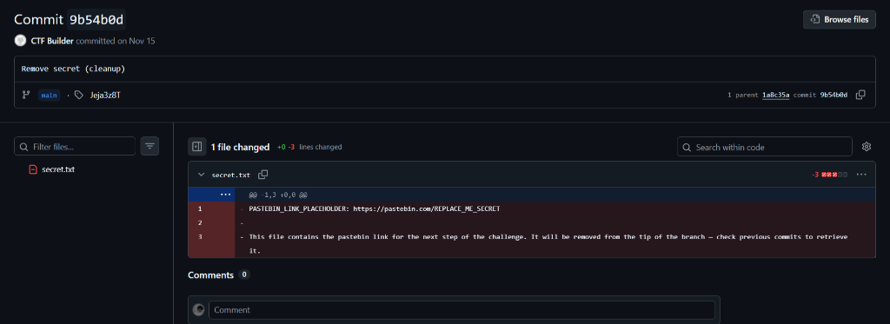

However, the actual link was missing. We checked the git tags for hidden metadata:


```bash
git tag
```
**Output:**
```
Jeja3z8T
```
This string `Jeja3z8T` looked like a Pastebin ID.

## Part 6: Geolocating Anor Londo
We constructed the URL: `https://pastebin.com/Jeja3z8T`.

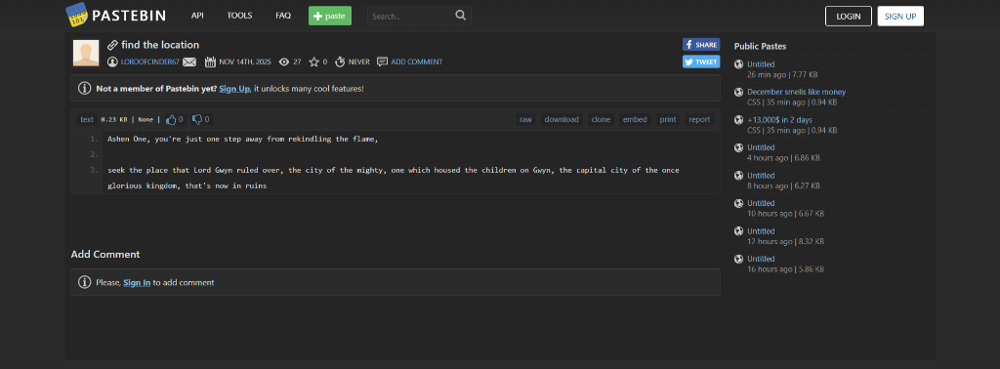

The paste contained a riddle:

> "Ashen One, you're just one step away from rekindling the flame,
> seek the place that Lord Gwyn ruled over, the city of the mighty, one which housed the children on Gwyn, the capital city of the once glorious kingdom, that's now in ruins"

A quick search on Dark Souls lore confirmed this location is **Anor Londo**.

The final step required searching "Anor Londo" on Google Maps. Interestingly, there were real-world markers for this fictional location. We checked them one by one.
A marker located at **J8JQ+6X, Es Senia, Algeria** had a review section containing the flag.

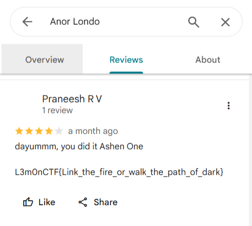

## Flag
`L3m0nCTF{Link_the_fire_or_walk_the_path_of_dark}`
